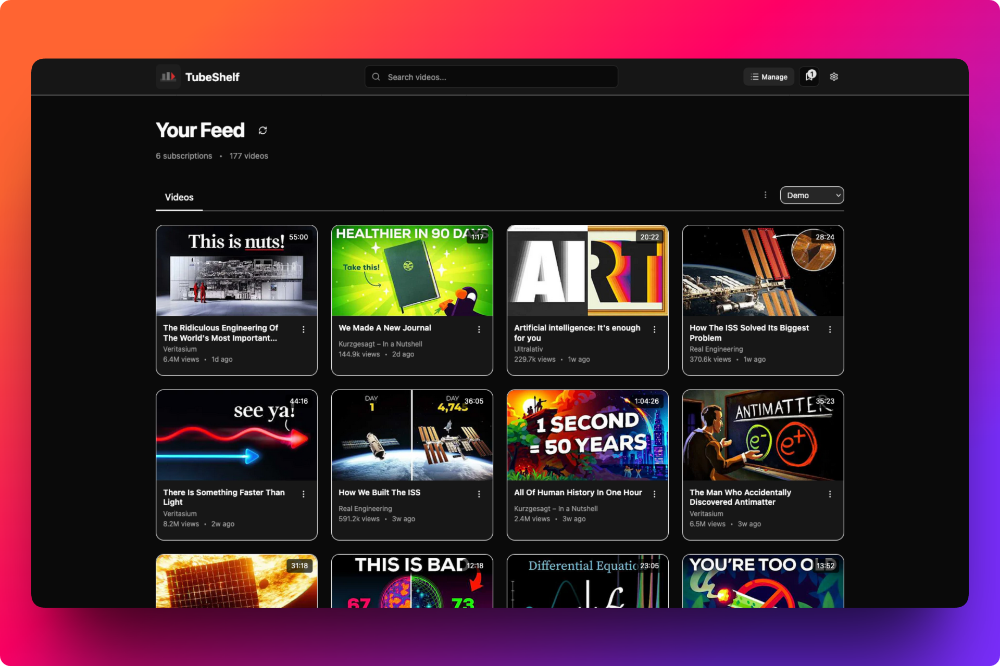

<div align="center">
  <picture>
    <source srcset="public/icon-dark.svg" media="(prefers-color-scheme: dark)">
    <source srcset="public/icon-light.svg" media="(prefers-color-scheme: light)">
    
  </picture>
  <h1>TubeShelf</h1>
  <h3>Self-hosted YouTube subscription feed<br />chronological, distraction-free, yours.</h3>
</div>

<p align="center">
  
</p>

> [!WARNING]
> TubeShelf is in early development and subject to breaking changes. Expect bugs and missing features. Contributions and feedback are welcome!

**TubeShelf** is a self-hosted YouTube subscription experience without a Google account. Browse your subscriptions in a clean, chronological feed - no algorithm, no tracking, just the videos you want in the order they were uploaded.

## Features

- **Chronological feed** - Videos sorted by upload time, newest first
- **Subscribe easily** - Add channels via URL, ID, or @handle
- **Import/Export** - OPML support for migrating subscriptions
- **Mark as watched** - Track what you've seen
- **Hide watched videos** - Filter option to show only unwatched content
- **Watch later** - Save videos for later viewing

## Quick Start

### Docker Compose (Recommended)

```yaml
services:
  tubeshelf:
    image: ghcr.io/samumatic/tubeshelf:latest
    container_name: tubeshelf
    restart: unless-stopped
    ports:
      - "3000:3000"
    user: "1000:1000"
    security_opt:
      - no-new-privileges:true
    volumes:
      - ./data:/app/data
```

Start the container:

```bash
# Create data directory with correct permissions
mkdir -p data
chown 1000:1000 data

# Start TubeShelf
docker compose up -d
```

Access the web UI at **http://localhost:3000**

## Why TubeShelf?

Some Invidious instances do work, though with varying issues. However, they aim to replicate the entire YouTube interface. **TubeShelf** takes a different path: instead of building an alternative YouTube frontend, it focuses on a single, well-defined goal:  
A distraction-free subscription feed without a Google account.

It fetches videos from your subscriptions and displays them chronologically. Click any video to open it on YouTube.

## AI Assistance Disclaimer
This project was developed with assistance from AI/LLMs (including GitHub Copilot, ChatGPT, and related tools), supervised by humans who occasionally knew what they were doing.

## License

This project is licensed under [AGPL-3.0 License](LICENSE).
